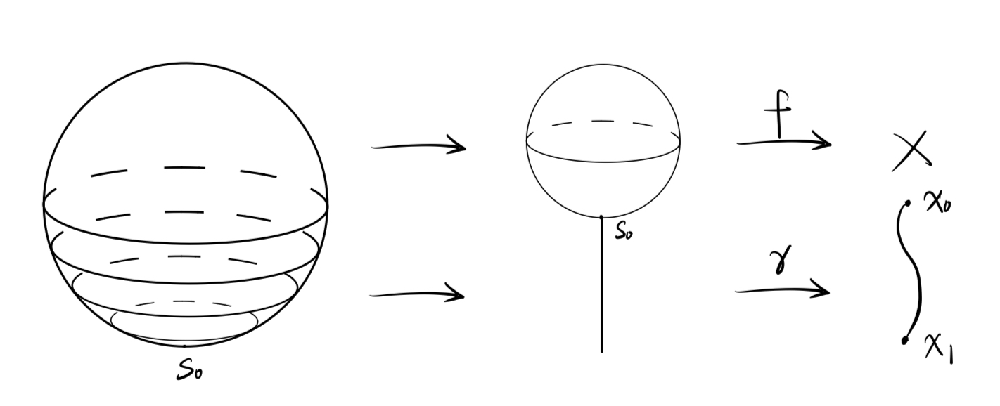
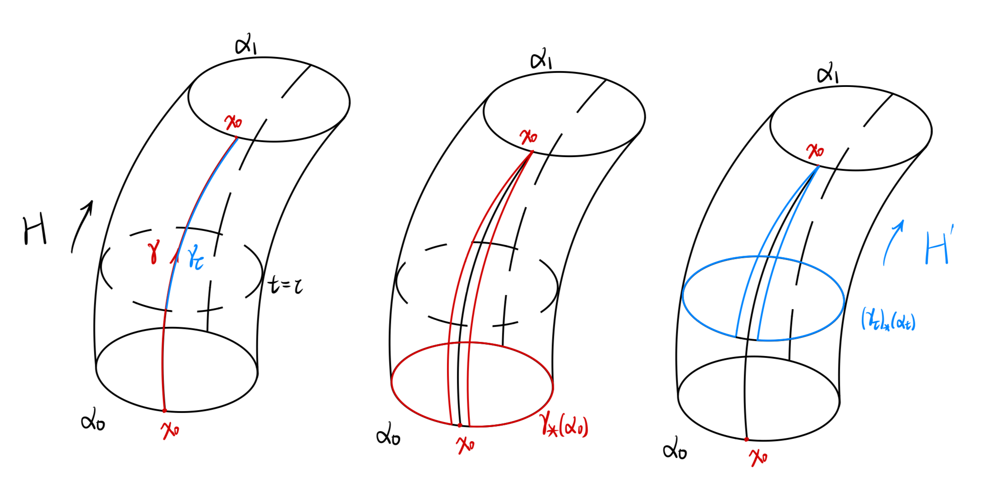
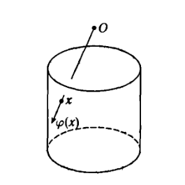

# Homotopy Theory

All spaces under consideration are connected.

### Homotopy groups
**Def:** omit. 

### Dependency of base point
For a general space $X$, the homotopy group $\pi_n(X,x_0)$ is usually depent on the base point $x_0$. That is, given two points $x_0$ and $x_1$, we usually can't find a well-defined isomorphism between $\pi_n(X,x_0)$ and $\pi_n(X,x_1)$. 

Any path $\gamma$ from $x_0$ to $x_1$ can induces a homomorphism 

$$\gamma_*:\pi_n(X,x_0)\to\pi_n(X,x_1)$$ 

The following figure provides a nice illustration. 

    

 

One can check that $\gamma_*$ is an isomorphism with inverse $\gamma_*^{-1} = \bar{\gamma}_*$. Moreover, 

$$\gamma\simeq\gamma'\;\mathrm{rel}\,\{0,1\}\Longrightarrow \gamma_*=\gamma'_*.$$ 

Especially when the path $\gamma$ strats and ends at the same point $x_0$, that is, $\gamma$ is a loop at $x_0$, we get a $\pi_1(X,x_0)$-action on $\pi_n(X,x_0)$ by:

$$\gamma\cdot\alpha = \gamma_*(\alpha),\quad\gamma\in\pi_1(X,x_0),\;\alpha\in\pi_n(X,x_0).$$ 

Moreover, we have an equallity 

$$\pi_n(X,x_0)\big/\pi_1(X,x_0)=[S^n,X].$$ 

When $\pi_1(X,x_0)$ acts on $\pi_n(X,x_0)$ trivially, we say $X$ is $n$-simple. Under this assumption, the isomorphism between $\pi_n(X,x_0)$ and $\pi_n(X,x_1)$ is canonically defined. Therefore we can use the notation $\pi_n(X)$ unambiguously. 

**Theorem:** $\pi_n(X,x_0)\big/\pi_1(X,x_0)=[S^n,X].$ 

<u>Proof:</u> In order to avoid ambiguity, we use $[\alpha]_n$, $[[\alpha]_n]_1$, $[\alpha]$ to denote elemets in $\pi_n(X,x_0)$, $\pi_n(X,x_0)\big/\pi_1(X,x_0)$, $[S^n,X]$ repeactively. 

The map between $\pi_n(X,x_0)\big/\pi_1(X,x_0)$ and $[S^n,X]$ is naturally given, that is,

$$\begin{align*}
    \phi:\pi_n(X,x_0)\big/\pi_1(X,x_0)&\to[S^n,X] \\
    [[\alpha]_n]_1&\mapsto[\alpha].
\end{align*}$$

$\phi$ is surjective: For any $[\alpha]\in[S^n,X]$, let $x_1=\alpha(s_0)$. If $x_1 = x_0$, then 
$$\phi([[\alpha]_n]_1)=[\alpha].$$
If $x_1\neq x_0$, there is a path $\gamma$ from $x_0$ to $x_1$, then 
$$\phi([[\bar{\gamma}_*(\alpha)]_n]_1)=[\bar{\gamma}_*(\alpha)] = [\alpha].$$

$\phi$ is injective: If $[\alpha_0] = [\alpha_1]$, where $\alpha_0,\alpha_1:(S^n,s_0)\to(X,x_0)$. By definition of $[S^n,X]$, there is a homotopy 
$$H:S^n\times I\to X$$
satisfying $H(-,0)=\alpha_0(-),\,H(-,1) = \alpha_1(-)$. We denote $\alpha_t(-) = H(-,t)$. Let 
$$\gamma(t):=H(s_0,t),\quad t\in I.$$
This defines a loop at $x_0$. Set 
$$\gamma_\tau(t)=\gamma(\tau+(1-\tau)t)=H(s_0,\tau+(1-\tau)t),\quad t\in I.$$ 
$\gamma_\tau$ is a path from $\gamma(\tau)$ to $\gamma(1) = s_0$. Now we can give a homotopy between $\gamma_*(\alpha_0)$ and $(c_{x_0})_*(\alpha_1)$ which fixes the base point:
$$\begin{gather*}
    H':(S^n,s_0)\times I\to(X,x_0) \\
    H'(-,t)=(\gamma_t)_*(\alpha_t)(-).
\end{gather*}$$
Since $\alpha_t(s_0) = H(s_0,t)=\gamma(t) = \gamma_t(0)$, the formula behind is well-defined. Moreover, 
$$\begin{gather*}
    H'(-,0)=\gamma_*(\alpha_0)(-),\\
    H'(-,1)=(c_{x_0})_*(\alpha_1)(-);\\
    H'(s_0,t)=(\gamma_t)_*(\alpha_t)(s_0)=x_0,\quad t\in I.
\end{gather*}$$
So $H'$ is what we need. Therefore 
$$\gamma_*([\alpha_0]_n)=[(c_{x_0})_*(\alpha_1)]_n=[\alpha_1]_n.$$
So that
$$[[\alpha_0]_n]_1=[[\alpha_1]_n]_1.$$ 

    

### Homotopy Lifting Property & Homotopy Extending Property
**Homotopy Lifting Property:** omit.

**Borsuk's Lemma:** Any CW pair $(X,X')$ admits homotopy extending property.

<u>Proof:</u> Suppose $X$ is a CW complex, $X'$ is its subcomplex and $f':X'\to Y$ can extend to $f:X\to Y$. For any homotopy $F':X'\times I\to Y$ with initial map $f'$, we extend it by induction. 

**Step 1:** For any vertex $x_0\in X^0 - X'$, we define 

$$F(x_0,t) = f(x_0), \quad t\in [0,1]$$ 

**Step 2:** Suppose we have extended the homotopy over the skeleton $X^n$. Now for any $(n+1)$-cell 

$$\psi:D^{n+1}\to X$$ 

The homotopy has been already defined on $S^n\times I$ and $D^{n+1}\times\{0\}$. To fill in the whole $D^{n+1}\times I$, we use the fact that there is a nice retraction (projection) 

$$r:D^{n+1}\times I\to(S^n\times I)\cup(D^{n+1}\times\{0\})$$ 

The following figure provides a nice illustration.

    

Thus we can extend the homotopy to any $(n+1)$-cell, so as $X^{n+1}$. 

### Exact Sequences for Fibrations. 
Given a fibration $p:E\to B$ with fibre $F$, we can derive an extremely useful long exact sequence of homotopy groups. First choose a base point $b_0\in B$, then choose $e_0\in p^{-1}(b_0)$. The fibering map $p$ induces a homomorphism
$$p_*:\pi_n(E,e_0)\to\pi_n(B,b_0),\quad \forall\,n$$
Besides, the inclusion $i:F=p^{-1}(b_0)\hookrightarrow E$ induces
$$i_*:\pi_n(F,e_0)\to\pi_n(E,e_0),\quad\forall\,n$$
The key is to construct a connecting homomorphism $\partial_*$.